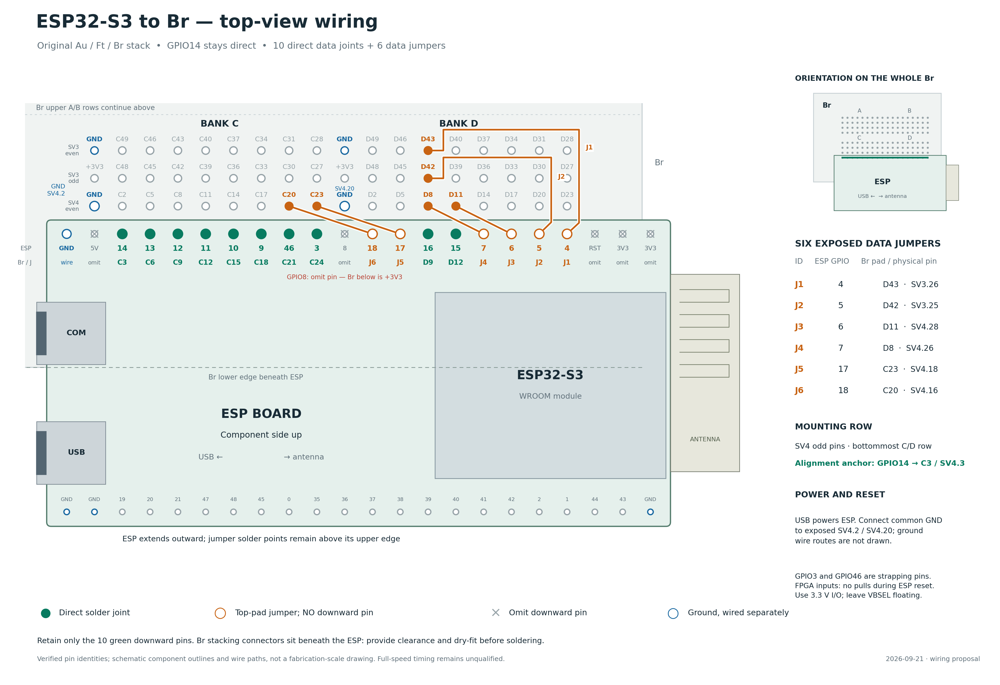
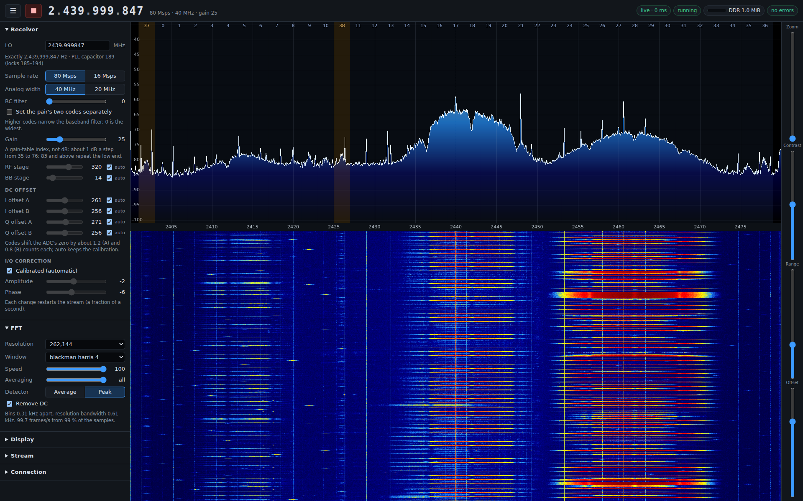
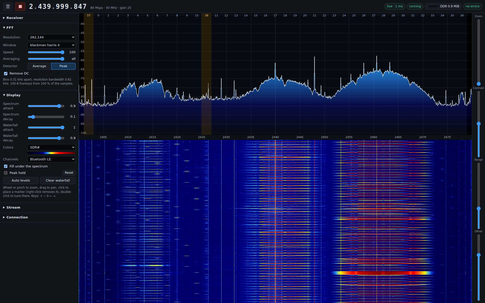
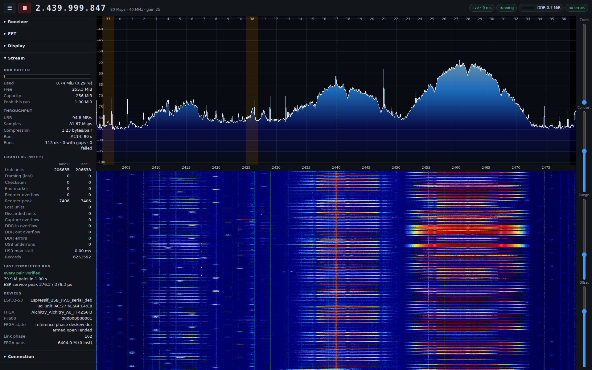
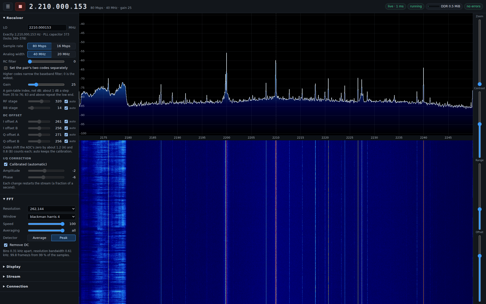
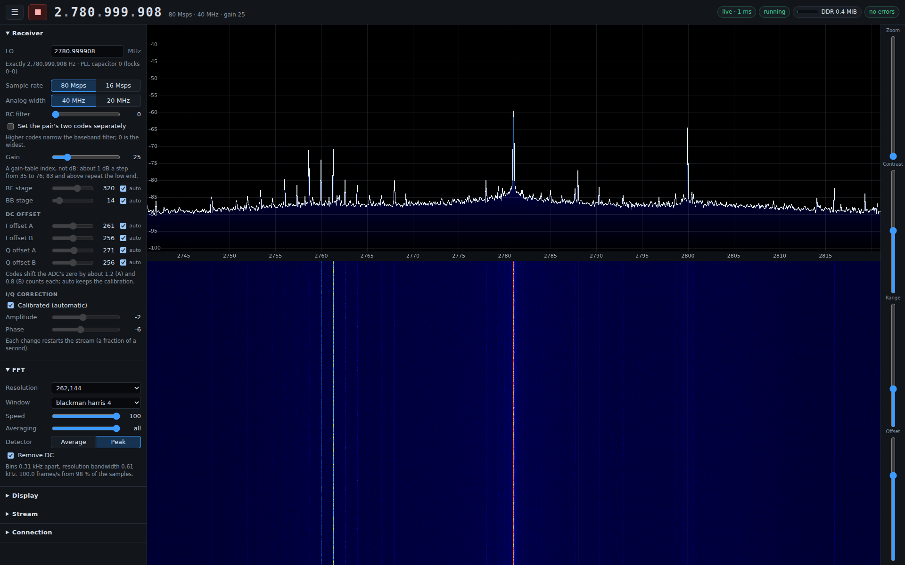

# eSpDR: 80 Msps ESP32-S3 SDR

eSpDR (ESP + SDR) streams raw baseband IQ from an ESP32-S3 radio to a Linux
host at 80 Msps, with lossless compression and end-to-end integrity checks.
Its host tool, `iqstream`, handles capture, receiver control and the live web
frontend.

```
ESP32-S3 ADC ──16 GPIO lines──▶ Alchitry Au FPGA ──FT600 USB 3──▶ host
80 Msps, 20-bit IQ pairs        reorder, lossless compression,     parallel decoding,
2 × 8-bit lanes, 240 MHz        256 MiB DDR3 buffer                verification, output
```

* 80 million IQ pairs per second, I and Q as 10-bit two's complement, centred on
  a 2440 MHz LO (a sampled span of 2400–2480 MHz). The analog response is
  not flat across that span, and out-of-band signals can alias into it. The
  raw ESP convention is LO minus RF for I+jQ.
* The whole stream is checked: every compressed record carries a CRC, and at
  the end the pair counts and a whole-stream CRC are reconciled across the
  ESP, the FPGA and the host. If the FPGA ever fails to receive a link unit
  (about 190 µs of samples), the stream continues and the loss is reported
  as an exact gap in sample time.
* Typical over-the-air input compresses to about 1.2 bytes per pair, around
  95–100 MB/s. The USB path sustains about 190 MB/s. Incompressible input
  needs 202.5 MB/s including record headers; the 256 MiB DDR buffer absorbs about 20 s
  of it, or about 2.5 s of a completely stalled host at typical rates.
  Any lost samples are counted and reported.
* Receive only.
* `iqstream serve` shows a live spectrum and waterfall in a web browser,
  with receiver controls, live stream counters and DDR buffer usage.

## About this project

This project is a technical capability proof of concept and a starting point
for further tinkering. Most of the implementation ideas and the system
architecture are mine. All original project code was written by AI: GPT 6
Astra and Opus 5.5 took turns over about two weeks, with my direct guidance
and supervision.
The entire web frontend was
one-shotted by Opus 5.5 with the prompt "make an SDR#-inspired WebGL-based web
frontend." Getting the actual acquisition working took _much_ longer.

## How it works

For the radio details, see [Inside the eSpDR receiver](docs/RADIO.md): how
the hardware supplies I/Q, PLL tuning, sample rates, filters, gain and
DC/IQ correction, with results from the development measurements.

### The radio IQ path

The samples come from the Wi-Fi/Bluetooth radio's internal receive path after
RF downconversion. The selected radio dump format supplies signed
**10-bit I and 10-bit Q**. An
undocumented hardware sample-dump engine writes those pairs directly to internal
SRAM.

The supported dump rates are **80 million IQ pairs/s** and **16 million IQ
pairs/s** (`rate=80` and `rate=16`). Radio configuration and capture live in
[`radio.c`](esp32s3/src/radio.c) and [`capture.c`](esp32s3/src/capture.c).

### Four SRAM banks and two CPU-driven output lanes

The dump engine stores each pair in a **32-bit word**: I in bits 0–9, Q in
bits 10–19, with the remaining bits unused. At 80 Msps that is **320 MB/s**
entering SRAM. To keep acquisition running while completed samples are sent,
the firmware rotates through four 64 KiB banks holding 16,384 pairs each.
Core 0 services banks 0 and 2; core 1 services banks 1 and 3. They switch the
writer to the next bank before the current bank fills, locate the exact sample boundaries, and send
the completed unit while acquisition continues in another bank.

Getting the samples out takes both cores, running bare metal at 240 MHz.
Each bit-bangs an eight-bit dedicated-GPIO lane using `wur.gpio_out`, giving
16 data wires in total. Both cores handle acquisition control, polling,
packing, checksums and output. Espressif's
[dedicated GPIO documentation](https://docs.espressif.com/projects/esp-idf/en/stable/esp32s3/api-reference/peripherals/dedic_gpio.html)
explains how these CPU instructions bypass ordinary memory-mapped GPIO access.

### Packing and the bandwidth budget

The 320 MB/s SRAM format exceeds the GPIO link's 240 MB/s ceiling, so the
firmware packs each pair down to its 20 useful bits. The assembly kernel in
[`transmit.S`](esp32s3/src/transmit.S) uses the S3's 128-bit SIMD instructions
to pack **16 IQ pairs into 40 bytes**, bringing the payload down to 200 MB/s.
Each group contains 32 bytes of low 16-bit values plus eight bytes holding
the remaining four bits of each pair. Loads, packing and
checksum accumulation are interleaved with the GPIO writes.

| Quantity | Rate at nominal 80 Msps |
|---|---:|
| Unpacked SRAM words: 4 bytes per IQ pair | 320 MB/s |
| Packed IQ payload: 2.5 bytes per pair | 200 MB/s |
| Absolute maximum GPIO data rate: 240 MHz × 2 cores × 8 bits/core / 2 instructions/sample | 240 MB/s |
| Two-lane packing loop: 40 bytes per 91 CPU cycles per lane | about 211 MB/s, before framing and bank-service overhead |
| FPGA raw-fallback records: 2,560 payload bytes + 32-byte header per 1,024 pairs | 202.5 MB/s |

The packing loop's rate follows from `2 × 240 MHz × 40 / 91`. Each complete
link unit also includes time for markers, headers, trailers, fragment transitions
and bank preparation. [`protocol/link.h`](protocol/link.h) defines the layout and
cadence shared by the ESP and FPGA.

### Memory placement and link timing

That throughput uses all 16 fast GPIO lanes available through the CPU's
`wur.gpio_out` register interface for data. A strobe could go on an ordinary
memory-mapped GPIO, but would do little to help with byte sampling; that path
cannot supply a clock at the required rate. At roughly 100 MHz, independent
ESP and FPGA clocks would let the
sampling point drift across pin transitions. To keep them aligned, the FPGA
feeds the ESP its 40 MHz reference. Its 240 MHz sampler then follows the
firmware's exact instruction timings, starting from a unit marker, and samples
between pin transitions. Each byte is normally held for two CPU cycles, with
fixed gaps for packing and unit boundaries. Calibrating the sampling phase
accounts for the delays in the wiring.

Instruction and data fetch stalls break that fixed schedule and throw the bus
out of synchronisation. Testing established that SRAM bank separation is
required for both code and data accessed on the timed path. Bank contention
caused stalls with unpredictable frequency and position within the buffer;
in one observed case, a data access on one core stalled an instruction fetch
on the other. Each core therefore runs its own transmit kernel from a separate
bank, with data placement arranged to avoid contention during transmission.
[`memory.ld`](esp32s3/memory.ld) fixes those kernel addresses and reserves the
capture memory. Shared control state is handled outside the transmit kernel.

### Fitting the stream through USB

The packed stream, with record headers, is 202.5 MB/s, while the USB path
sustains about 190 MB/s. The FPGA checks and reorders the two lanes, then
**losslessly compresses the samples before writing them to its DDR ring**.
Typical over-the-air input comes down to 95–100 MB/s. The 256 MiB ring absorbs
bursts of incompressible data and pauses in host reads while the FT600 drains
it over USB. The host decodes the records and checks their CRCs, pair counts
and whole-stream CRC against the ESP and FPGA totals.

### RF tuning

Tuning to a new frequency also requires selecting a suitable VCO capacitor
setting so the PLL can lock. The firmware sets the frequency word, scans all
512 capacitor codes, and picks the middle of the longest interval reporting
lock. The capacitor bank tunes the VCO's operating range, and the PLL's
frequency-divider feedback sets the frequency.

Bench work found a lock range of roughly 2.2–2.8 GHz in the tested
configuration. The current UI accepts 2210–2790 MHz; a failed lock restores
the previous LO. The receiver settings and screenshots below include the
upper-limit capture from this board.

## Hardware

* **Alchitry Au** (Artix-7 XC7A35T, 256 MiB DDR3) with the **Ft** (FTDI FT600)
  and **Br** (breakout) boards stacked.
* **ESP32-S3-WROOM-1 development board** with two USB ports: native USB
  (USB Serial/JTAG) and a "COM" USB-UART bridge whose RTS/DTR drive EN/BOOT.
  Both connect to the host, as do the Au and the Ft.
* The FT600 must be configured once (FTDI's *FT60X Chip Configuration
  Programmer*) for **245 FIFO mode, 1 IN channel, 100 MHz clock**.

### Wiring

Link lines (ESP GPIO → FPGA ball). Lane 0 is driven by CPU core 0, lane 1 by
core 1. Use short, direct wires and a common ground (Br SV4.2 / SV4.20).

| Lane.bit | ESP GPIO | FPGA | | Lane.bit | ESP GPIO | FPGA |
|---|---:|---|---|---|---:|---|
| 0.0 | 4  | T15 | | 1.0 | 3  | P5  |
| 0.1 | 5  | T14 | | 1.1 | 46 | M5  |
| 0.2 | 6  | P14 | | 1.2 | 9  | L4  |
| 0.3 | 7  | R16 | | 1.3 | 10 | P4  |
| 0.4 | 15 | M15 | | 1.4 | 11 | N3  |
| 0.5 | 16 | R15 | | 1.5 | 12 | R10 |
| 0.6 | 17 | L5  | | 1.6 | 13 | R12 |
| 0.7 | 18 | N4  | | 1.7 | 14 | R13 |



[Open the zoomable wiring diagram](docs/images/esp32s3-br-top-view.svg).
The drawing shows the data connections. Add the shared 40 MHz clock connection
described below. The link timing measurements below were made after the drawing.

**Shared clock.** All 16 fast CPU-register GPIO lanes carry data, so the FPGA
uses the firmware's instruction timings to work out when to sample each byte.
Feeding its 40 MHz
reference to the ESP keeps those sampling times aligned with the output.
FPGA ball **D1** (Br B2) drives the ESP32-S3's **XTAL_P** input.
On the WROOM-1 module, remove the
crystal's series part R4 and wire D1 to its XTAL_P-side pad. The crystal stays
installed. The FPGA keeps D1 high-impedance until `iqstream load` enables it
while the ESP is held in reset.

Wiring delays determine where between pin transitions it is safe to sample.
The FPGA's per-line input delays (`fpga/rtl/link_input.v`, `TAPS`) and its
sampling phase (`DEFAULT_PHASE` in `fpga/rtl/iqstream_top.v`) were measured
for this wiring with the ESP driving its link lines at 10 mA: the passing
window is about 1.6 ns wide and the default sits in its centre.
For your wiring, run `iqstream calibrate` (below).

## Building

Each part builds on its own:

| Part | Requires | Command | Output |
|---|---|---|---|
| ESP32-S3 firmware | ESP-IDF v5.5 (`. $IDF_PATH/export.sh`) | `make -C esp32s3` | `esp32s3/build/iq-source.bin` |
| FPGA image | Vivado 2025.2 (`vivado` on `PATH`, or `VIVADO=...`) | `fpga/build.sh` (about 30 min) | `fpga/build/iqstream.bit` |
| Host tool | C++17, zlib, FFTW3 single precision (`libfftw3-dev`), [FTDI D3XX](https://ftdichip.com/drivers/d3xx-drivers/) for Linux | `make -C host D3XX_DIR=/path/to/d3xx` | `host/build/iqstream` |
| Tests | C++17, zlib, FFTW3, Verilator 5 | `tests/run.sh` (`--long` adds a full-size run) | pass/fail |

From the repository root, add the built host tool to your shell's `PATH` for
the commands below:

```sh
export PATH="$PWD/host/build:$PATH"
```

The FPGA build fails unless every timing constraint is met. The firmware build
fails if any of its functions would be shadowed by a same-named ROM function.

Loading also needs `openFPGALoader` and `esptool.py` (part of ESP-IDF) on
`PATH`, or set `OPENFPGALOADER` / `ESPTOOL`, for example
`ESPTOOL="python -m esptool"`. The user needs access to the serial ports and
the FT600 (udev rules for `0403:601e`).

## Running

Load both devices into RAM. A power cycle restores the boards.

```sh
iqstream load --fpga fpga/build/iqstream.bit --esp esp32s3/build/iq-source.bin
```

This holds the ESP in reset, loads the FPGA, starts the 40 MHz reference,
boots the ESP into its ROM loader and loads the firmware, which then calibrates
the radio. Repeat it after any power cycle. To reload only the ESP, drop
`--fpga`.

Capture:

```sh
iqstream capture --seconds 10                         # verify only
iqstream capture --seconds 60 --output capture.iqc    # compressed records (~1.2 B/pair)
iqstream capture --seconds 5 --output capture.cs16    # int16 I, Q (4 B/pair)
iqstream capture --seconds 0 --output - | consumer    # until Ctrl-C, to stdout
```

`capture` prints progress, then a summary. Exit status:

| Status | Meaning |
|---|---|
| 0 | every pair received, decoded and matched against the ESP's and the FPGA's counts and CRCs |
| 3 | complete, but some link units were lost: the summary gives the number of gaps and pairs; every delivered pair is verified and indices (and `.cs16` output) keep sample time |
| 1 | failed; the summary lists what did not reconcile |

The summary and progress go to stderr, so `--output -` can feed a pipe.
When a consumer falls behind, it back-pressures USB. The FPGA's 256 MiB DDR
buffer holds the incoming samples until the host catches up or the buffer fills.

The FPGA carries one stream at a time. A capture opens it and closes it when it
finishes, and while it is open the FPGA refuses to start another. Only one
`iqstream` process can use the devices at once. If a capture is killed, the
next capture closes the stream it left open and says so.

Other commands:

```sh
iqstream decode capture.iqc capture.cs16   # .iqc to interleaved int16
iqstream status                            # identities, readiness, receiver settings, last-run counters
iqstream set lo=2426M gain=40              # change receiver settings (below)
iqstream calibrate                         # measure the link sampling window, use its centre
```

`calibrate` streams for one second at every fourth sampling phase across the
full 240 MHz period (a few minutes), reports the window without link errors
and sets the FPGA to its centre until the FPGA is reloaded. Reuse the measured
phase with `iqstream load ... --phase P`, or set `DEFAULT_PHASE` and rebuild.

Devices are found automatically in `/dev/serial/by-id` and by FT600 serial
number. With several boards attached, choose with `--esp-port`, `--fpga-port`,
`--com-port`, `--ftdi-serial` and `--ft600`.

## Receiver settings

The ESP boots with the LO at 2440 MHz, gain selector 24, 80 Msps, 40 MHz
analog width, RC filter code 0 and everything else automatic. `iqstream set`
(or the browser) changes them; they last until the ESP is reloaded, and
`status` shows them. Each change reconfigures the whole receive path, so it
is made between captures.

| Setting | Values | Notes |
|---|---|---|
| `lo=` | 2210–2790 MHz (`2402M`, `2.44G`, Hz) | Steps of 457.76 Hz; the exact LO is reported. A failed PLL lock keeps the previous LO |
| `rate=` | `80`, `16` | Msps; the spectrum spans the sample rate |
| `width=` | `40`, `20` | Analog channel width, MHz |
| `filter=` | `N` or `N,M`, 0–63 | Baseband RC filter codes of the width's register pair; higher is narrower, 0 widest |
| `gain=` | 0–127 | A gain-table index, not dB: about 1 dB a step from 35 to 76; 83 and up repeat the low end. Sets both gain stages |
| `rf=`, `bb=` | 0–511, 0–127, or `auto` | The RF and baseband gain stages directly, overriding the table |
| `dc0=`…`dc3=` | 0–511 or `auto` | DC offset: 0, 1 shift I and 2, 3 shift Q, by about 1.2 and 0.8 ADC counts a code |
| `iq=` | `A,P` or `auto` | I/Q correction: amplitude −16…15 (about 1/64 a step), phase −32…31 (about 1/128) |

`auto` keeps the vendor calibration or the gain table's value.

## Live spectrum in a browser

```sh
iqstream serve                              # http://127.0.0.1:8073/
iqstream serve --listen 0.0.0.0:8073        # reachable from other machines
```

Open the address in a browser with WebGL 2 support. From a
remote workstation, forward the port (`ssh -L 8073:127.0.0.1:8073 host`, or
the editor's port forwarding) rather than listening on every interface: the
page controls the receiver and has no login.

The page is modelled on SDR#: the LO in large digits (scroll or click a
digit; press Enter or type to enter a frequency), a spectrum over a
waterfall, and Zoom, Contrast, Range and Offset beside them. Wheel or pinch
to zoom, drag to pan, click for a marker, right-click to remove it,
double-click to tune there. The side panels hold:

* **Receiver**: every setting above.
* **FFT**: resolution, window, speed (frames per second), averaging and
  detector. The defaults are SDR#'s: 4096 points, Blackman-Harris 4, 40
  frames a second, one block per frame; peak detection over more blocks
  shows short bursts such as Bluetooth advertisements. Levels are dBFS: a
  full-scale tone reads 0.
* **Display**: SDR#'s spectrum and waterfall attack and decay, colours, a
  Bluetooth LE or Wi-Fi channel plan, peak hold. Kept in the browser.
* **Stream**: the FPGA's DDR buffer (used, free, capacity, peak), throughput
  and compression, every error counter of the current run as it happens,
  and the verification result of the last completed run.
* **Connection**: round trip, frame rate, link use, and limits on frame rate,
  bandwidth and resolution.

Every run uses the same verification as `capture`. Changing a receiver setting
ends and verifies the current run, then starts another with the new settings.
Stop ends and verifies the current run and leaves streaming paused. Streaming
also pauses after ten seconds without a browser connected. `serve` holds the
devices, like any other command: stop it (Ctrl-C) to run `capture`. If the
devices are not loaded yet, the page says so and `serve` keeps trying.

One browser is served at a time; opening the page elsewhere takes over, and
the first page offers to take it back.

A slow browser connection can turn a queue of spectrum frames into a delayed
view of the radio. To keep the display current, the server fits frames to the
visible range and screen width, and limits how many can be awaiting an
acknowledgement. When the connection falls behind, it merges frames, keeping
their peaks in peak mode so short signals still show. Automatic resolution
reduces the bins per frame in steps until about 15 frames a second get through.
The page reconnects by itself, with the receiver as it was.

### Screenshots

Live hardware at 80 Msps, using the maximum 262,144-point FFT and 100 fps
setting, with all FFT blocks included, peak detection and DC removal enabled.
The overview captures use a 2440 MHz LO and gain selector 25; the display uses a
−34 to −101 dBFS scale and Bluetooth LE channel overlays. Click an image
to view it at full resolution.

**Receiver and FFT controls**, with the full 80 MHz span:

[](docs/images/web-receiver-fft.png)

**Display controls**, with the same live receiver and spectrum settings:

[](docs/images/web-display-ble.png)

**Stream statistics**, with live throughput, DDR buffer use and integrity counters:

[](docs/images/web-stream-status.png)

**Minimum LO: 2210 MHz**, showing the full 80 MHz span:

[](docs/images/web-lo-minimum.png)

**Upper LO: 2781 MHz**, the highest setting that locked during this capture
session's 1 MHz checks. This board returned a PLL lock error at 2782–2790 MHz.

[](docs/images/web-lo-maximum.png)

## Output formats

**`.cs16`**: interleaved little-endian `int16` I, Q, one pair per 4 bytes, values
−512..511. Lost pairs, if any, are written as zeros so the file keeps
sample time.

**`.iqc`**: the FPGA's compressed records, exactly as received, ending with the
END record. Each record holds up to 1024 pairs with its own header CRC and
data CRC; `protocol/iq_record.h` documents the format, and
`protocol/iq_record.cpp` is a reference decoder.

## Fixed configuration

| Setting | Where |
|---|---|
| Receiver settings at boot (LO 2440 MHz, gain selector 24) | `esp32s3/src/radio.h` |
| Control protocol, statistics | `protocol/control.h` |
| Link unit format and timing | `protocol/link.h` |
| Compressed record format | `protocol/iq_record.h` |

The FPGA and host build their constants from these headers.

## Repository layout

```
protocol/          shared definitions: control protocol, link format, record format + codec
esp32s3/           ESP32-S3 firmware (bare metal, both cores, RAM image)
fpga/              RTL, constraints, MIG configuration and Vivado build
host/              iqstream host tool; host/web: the browser UI, compiled into it
tests/             codec, spectrum, web server, link-receiver and RTL stream tests
docs/images/       wiring diagram and screenshots used by this README
```

Local recordings, screenshot originals, demo scripts, posts and measurement
artifacts belong in `local/`, which is excluded from Git. Selected README images
live in `docs/images/`. Build outputs are also ignored.

## Troubleshooting

* **`... is not running this iqstream's ESP firmware`** (or FPGA image): the
  host tool, the firmware and the FPGA image are built together from one
  tree; load the images built with this host tool.
* **`FPGA not ready: !reference`** (or `!ddr` ...): run `iqstream load` again.
  After a power cycle the reference is off and the ESP is not running.
* **Gaps (exit status 3), ESP acquisition failures or lane checksum
  errors**: link timing or wiring. Run `iqstream calibrate`; check ground and
  the D1 clock connection.
* **Reorder overflows**: the host stopped reading for longer than the DDR
  buffer covers (a few seconds at typical rates), so samples were dropped at
  the FPGA input. Write `.iqc` rather than `.cs16`, use a faster disk, or check
  that the FT600 is on a USB 3 port.

## License

Original eSpDR code is released under the [Zero-Clause BSD license (0BSD)](LICENSE).
You can use, modify and distribute that code for any purpose, including
commercially, without an attribution requirement.

Third-party code and dependencies retain their respective licenses, including
[Espressif's Apache-2.0 PHY library](https://github.com/espressif/esp-phy-lib)
and the MIT-licensed startup vectors in
[`vectors.S`](esp32s3/src/vectors.S). Redistributed firmware must include the
licenses and notices required by the components it contains.
